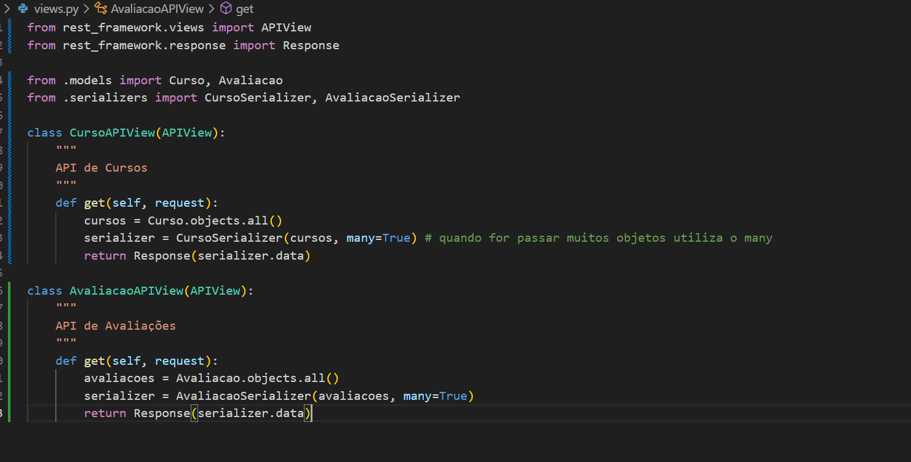

# COMANDOS - GUIA

1. Criar um ambiente virtual (venv) e ativá-lo&#x20;

* `python -m venv nomeVenv`
* `nomeVenv\Scripts\activate`

2. Instalação Django

* `pip install django`

3. Criar o arquivo onde ficará as dependências do projeto

* `pip freeze > requirements.txt`

4. Criar arquivo onde irá listar os arquivos que deseja ignorar&#x20;

* `.gitignore`

5. Criar projeto Django

* `django-admin startproject nomeProjeto .`&#x20;
* (" . " serve para não criar outra subpasta)

6. Criar app Django (onde estará os modelos, views...)

* `django-admin startapp nomeApp`
* Definir o nome desse app em `settings.py` no `INSTALED_APPS`:

<figure><figcaption></figcaption></figure>

* Ainda em `settings.py`:
* Trocar o idioma e horário

<figure><figcaption></figcaption></figure>

* Em `STATIC_URL` acrescentar embaixo:

<figure><figcaption></figcaption></figure>

* Importante dar um `import os` !&#x20;

_Django Rest Framework_

7. Instalação

* `pip install djangorestframework`

8. Registrar

* Vá em `INSTALED APPS` no arquivo `settings.py`&#x20;
* `'rest_framework'`

9. Criar Banco de Dados

* `python manage.py migrate`

10. Criar superuser

* `python manage.py  createsuperuser`&#x20;
* `python manage.py createsuperuser --username admin --email admin@example.com`

_Serializers_

* Criar um arquivo no seu app&#x20;
* `serializers.py`

* **Comando importante**
* `python manage.py runserver`
* Serve para rodar o servidor local e é interessante sempre usar para testar se sua aplicação está funcionando corretamente
