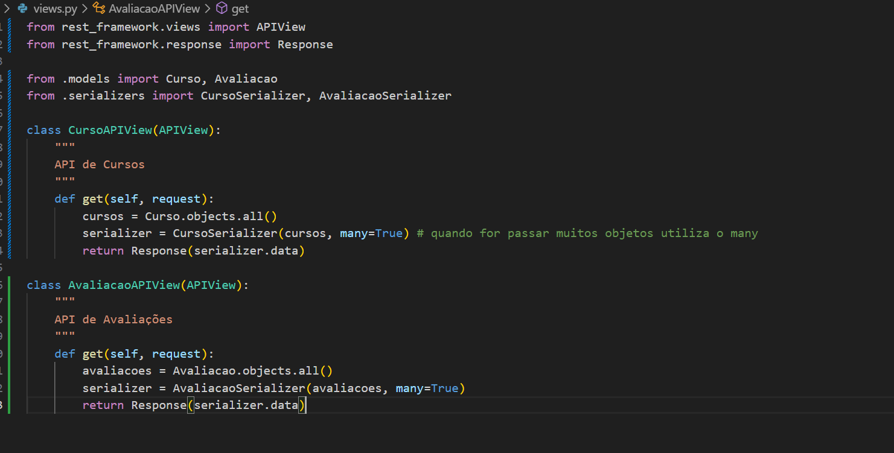

# Criação

1. Criar e selecionar a pasta onde ficará seu projeto

* Caso não saiba:



<figure><figcaption></figcaption></figure>

<figure><figcaption></figcaption></figure>

```python
pip freeze > requirements.txt
```
